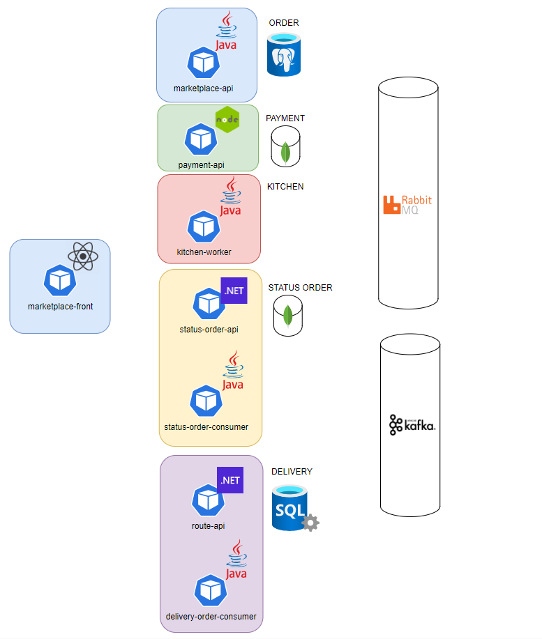

# micropizzeria microservices

### 1. Run separeted containers
1. [marketplace-front](./marketplace/)
2. [marketplace-api](./marketplace/)
3. [payment-api](./payment/)

### 2. Run docker compose:

<pre>docker-compose up -d</pre>
To destroy
<pre>docker-compose down</pre>

2.1. RabbitMQ Manager http://localhost:15672/ guest / guest 
 
2.2. CMAK Kafka Manager http://localhost:9000/

